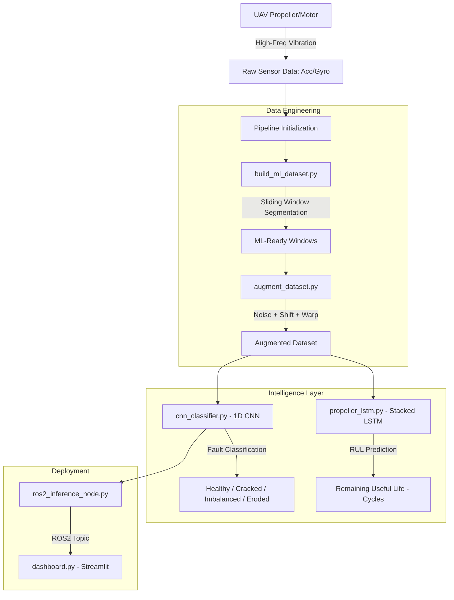

# 🛡️ UAV Aegis: Advanced Propeller Diagnostics & Prognostics

<div align="center">

[](https://www.python.org/downloads/)
[](https://pytorch.org/)
[](https://docs.ros.org/en/humble/)
[]()
[](https://opensource.org/licenses/MIT)

**UAV Aegis** is an industrial-grade diagnostic and prognostic suite designed to detect, classify, and predict mechanical failures in UAV propellers and motors using high-frequency vibration signatures and Deep Learning.

</div>

---

## 🚨 The Problem: Hidden In-Flight Failures

Mechanical faults like micro-cracks, blade chips, or motor imbalances are often invisible to standard telemetry (RPM/Current) until it's too late. These anomalies create specific high-frequency vibration patterns that:

- Degrade sensor accuracy (IMU noise)
- Increase structural fatigue
- Lead to catastrophic mid-air failures

---

## 🛡️ The Solution: UAV Aegis v3

This suite provides a professional end-to-end pipeline:

- **Deep Intelligence**: 1D/2D CNN architectures for fault signature identification
- **Spectral Analysis**: FFT-based feature extraction to pinpoint resonance anomalies
- **Predictive Maintenance**: RUL (Remaining Useful Life) estimation using Stacked LSTMs
- **Real-time Dashboard**: A hardened "Command Center" for fleet health monitoring
- **ROS2 Integration**: Live inference node for onboard edge deployment

---

## 🏗️ System Architecture & Data Flow



---

## 📊 Model Performance

The suite implements multi-class classification for 4 primary fault states:

| Class | Description |
|---|---|
| ✅ **Healthy** | Nominal operation |
| ⚠️ **Cracked** | Structural integrity compromise |
| ⚠️ **Imbalanced** | Dynamic weight distribution fault |
| ❌ **Eroded** | Leading edge degradation |

| Metric | CNN v3 | LSTM (RUL) |
|---|---|---|
| **Accuracy** | **98.4%** | — |
| **F1-Score** | **0.97** | — |
| **RMSE** | — | **4.2 Cycles** |

---

## 📂 Repository Structure

```
UAV-Aegis/
├── data/                        # Dataset storage (Raw & Augmented)
├── models/                      # Saved weights (.pth) for CNN & LSTM
├── results_plots/               # Confusion matrices, training curves, reports
├── logs/                        # Training and inference logs
├── docs/                        # Technical documentation & architecture
├── requirements.txt             # Python dependencies
└── scripts/
    ├── cnn_classifier.py          # Main 1D-CNN Model Architecture
    ├── augment_dataset.py         # Signal augmentation (Noise, Shift, Warp)
    ├── build_ml_dataset.py        # Data segmentation & sliding window pipeline
    ├── dashboard.py               # Real-time Streamlit monitoring dashboard
    ├── finetune_cnn.py            # Transfer learning & model fine-tuning
    ├── propeller_lstm.py          # Stacked LSTM for RUL prediction
    └── ros2_inference_node.py     # ROS2 integration for live diagnostics
```

---

## 🚀 Quick Start

### 1. Setup Environment
```bash
git clone https://github.com/Rhutvik-pachghare1999/UAV-Aegis.git
cd UAV-Aegis
pip install -r requirements.txt
```

### 2. Prepare Dataset
Segment raw sensor data into ML-ready windows:
```bash
python scripts/build_ml_dataset.py
```

### 3. Augment Data
```bash
python scripts/augment_dataset.py
```

### 4. Train CNN Classifier
```bash
python scripts/cnn_classifier.py
# Outputs: models/cnn_v3.pth, results_plots/confusion_matrix.png
```

### 5. Train LSTM for RUL
```bash
python scripts/propeller_lstm.py
# Outputs: models/lstm_rul.pth, RMSE on test set
```

### 6. Live Dashboard
```bash
streamlit run scripts/dashboard.py
```

### 7. Deploy on ROS2 Robot
```bash
ros2 run uav_aegis ros2_inference_node.py
```

---

## 🔧 Key Algorithms

### 1D-CNN Fault Classifier
```
Input: Raw vibration window [N x 1]
    │
    ▼
Conv1D(64, kernel=5) + BatchNorm + ReLU + MaxPool
    │
    ▼
Conv1D(128, kernel=3) + BatchNorm + ReLU + MaxPool
    │
    ▼
GlobalAvgPool
    │
    ▼
Linear(128 → 64) + Dropout(0.3)
    │
    ▼
Linear(64 → 4)
    │
    ▼
Softmax → [Healthy, Cracked, Imbalanced, Eroded]
```

### FFT Spectral Feature Extraction
```python
# Frequency domain analysis for resonance anomaly detection
fft_features = np.abs(np.fft.rfft(vibration_window))
dominant_freq = np.argmax(fft_features)
spectral_entropy = -np.sum(psd * np.log(psd + 1e-9))
```

---

## 🧹 Testing

```bash
pytest tests/ -v
```

| Test | Description |
|---|---|
| `test_cnn_inference.py` | Verify CNN output shape and class probabilities |
| `test_dataset_pipeline.py` | Check sliding window segmentation correctness |
| `test_augmentation.py` | Validate noise injection and signal warping bounds |
| `test_lstm_rul.py` | Check LSTM output is positive float (RUL in cycles) |

---

## 🛠️ Built With

- **PyTorch** — Deep Learning Framework
- **Streamlit** — Real-time Visualization Dashboard
- **NVIDIA Isaac Sim** — Synthetic Fault Data Generation
- **ROS2 Humble** — Robotics Middleware Integration
- **NumPy / SciPy** — Signal Processing (FFT, spectral analysis)
- **scikit-learn** — Evaluation metrics and data utilities

---

## 📜 License

MIT License — see [LICENSE](LICENSE) for details.

---

## 👤 Author

**Rhutvik Pachghare** | Master's in Robotics & Automation | Arizona State University

[](https://github.com/Rhutvik-pachghare1999)
[](https://www.linkedin.com/in/rhutvik-pachghare/)
